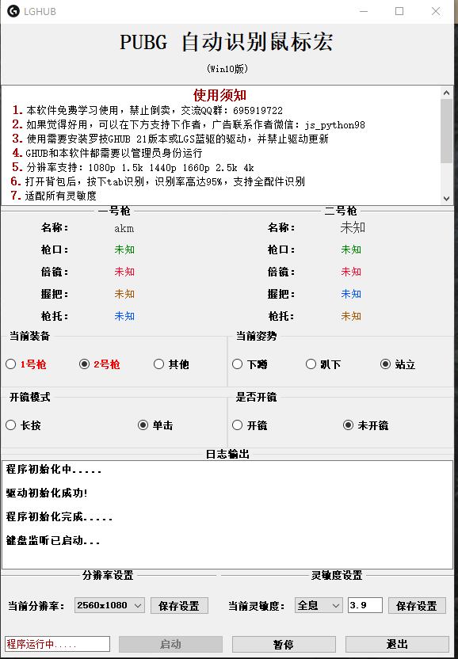

# PUBG-automatically-recognizes-macros
## 声明，此源码用于学习使用，用于其他用途和本人无关
PUBG-automatically-recognizes-macros是一个自动识别枪械并进行压枪的的工具，它利用opencv的sift算法进行识别，达到了一个素材全分辨率匹配，  
不用再去做各种分辨率的素材库，如果使用了里面的源码请标明出处，谢谢！
## 核心功能
- sift识别算法
- 智能识别当前开火状态
- 匹配所有灵敏度，无需修改游戏内灵敏度
## 环境安装
- 需要python >= 3.8.0
- 安装requirements.txt的库
## 源码模块说明
- bullet_data.py 枪械数据模块
- fire_data.py 枪械配件及名字和数据加密模块
- GHUB.py 调用GHUB的源码模块
- KeyListener.py 键盘按键功能模块
- main.py 主入口程序（启动用）
- MouseListener.py 鼠标按键功能模块
- Process.py 数据加载开火模块
- PUBG_UI.py UI模块
- recognition.py 图像识别模块
- resolution_setting.py 截图分辨率设置，开火检测坐标模块
- main.spec pyinstaller打包文件，定位到PUBG文件夹下，在终端使用pyinstaller main.spec即可打包成exe文件
## 使用方法
- 运行main.py程序，此时会弹出来gui界面，选择你的分辨率，点击保存，选择你的开镜模式，然后点击启动
- 按下tab截图识别，只要按下了tab就会进行截图识别，识别后按下键盘上的“1”或“2”切换枪械进行压枪
- 如果感觉枪械压不住调整灵敏度设置：
- 无：代表的是机瞄倍率，红点，全息，2倍，3倍，4倍，6倍，8倍，15倍，压过头调低灵敏度数值，压不住调高灵敏度数值，调完后记得保存，不保存没有效果
- 如果2号枪无法截图识别到，请调整resolution_setting.py模块相对于的分辨率截图位置，如果不知道截图是否正常截取，调整resolution.py的capture_and_compare函数，把里面的注释删除掉即可在test文件夹下面查看是否截图正常，正常后请注释掉，提升程序性能
## 目前没有精力维护这个项目了，本来想增加按键自定义和游戏内画面显示当前获取的枪械以及配件，这样就知道自己获取了哪些枪械和配件了
## 程序GUI界面展示
- 
